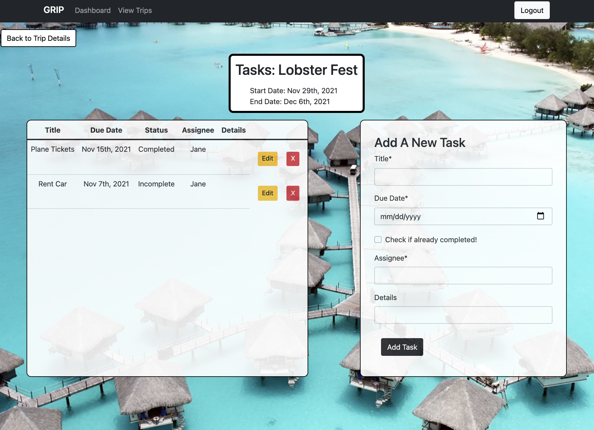

# GRIP 
 Get a GRIP on your next group trip!

[Link to GRIP](https://grip-your-trip.herokuapp.com/)
<!-- PROJECT LOGO -->
<br />
<p align="center">
  <a href="https://github.com/Korbin-Sargent/vacation-planning-app">
    
  </a>
  </p>
<!-- TABLE OF CONTENTS -->
<details open="open">
  <summary>Table of Contents</summary>
  <ol>
    <li>
      <a href="#about-the-project">About The Project</a>
            <ul>
        <li><a href="#built-with">Built With</a></li>
      </ul>
    </li>
    <li>
      <a href="#getting-started">Getting Started</a>
      <ul>
        <li><a href="#prerequisites">Prerequisites</a></li>
        <li><a href="#installation">Installation</a></li>
      </ul>
    </li>
    <li><a href="#usage">Usage</a></li>
    <li><a href="#roadmap">Roadmap</a></li>
    <li><a href="#contributing">Contributing</a></li>
    <li><a href="#license">License</a></li>
    <li><a href="#contact">Contact</a></li>
  </ol>
</details>

<!-- ABOUT THE PROJECT -->

## About The Project
<div align="center" >

</div>

Get a GRIP on your next group trip!

GRIP was created to help plan and organize upcoming trips with friends! Users are able to keep track of trip details, tasks that each group member need to complete, and an expense tracker to keep track of who spent what. GRIP was created because after the past year it's time to travel again, and we are looking forward to help your group organize their next trip. 

The application utilizies graphQL on the backend to keep track of all the trip data, and any updates and changes to the trip, tasks or expenses. On the frontend the application runs on react and creates a streamlined and seemless UI, to create an easy user experience. The application is currently deployed on a heroku server and is full compatible on mobile devices, so users can use the application anywhere. 


### Built With

This section lists any major frameworks that was used to build GRIP.

- [React-Bootstrap](https://react-bootstrap.github.io/)
- [MongoDB](https://www.mongodb.com/)
- [Apollo Client](https://www.apollographql.com/docs/react/)
- [GraphQL](https://graphql.org//)
- [Heroku](https://heroku.com/)
-[JWT](https://jwt.io/)
-[React](https://reactjs.org/)


<!-- GETTING STARTED -->

## Getting Started

For use of of application please visit our deployed application. Otherwise, please clone our repository to our local machine. You will need to npm install, and npm run develop in order to pull the appilcation on your local host. Please see installation for further directions. 

### Prerequisites

This is an example of how to list things you need to use the software and how to install them.

- npm
  ```sh
  npm install npm@latest -g
  ```

### Installation

2. Clone the repo
   ```sh
   git clone https://github.com/your_username_/Project-Name.git
   ```
3. Install NPM packages
   ```sh
   npm install
   ```
4. Enter your Local Database in `config.js`
```sh
   mongodb://localhost/
   ```
  

## Usage

The application was created for users to be able to organzie and plan upcoming trips. Currently users are asked to create a singlar username and password and use that to login and see thier trip information (a login is required to use the site). The users is able to create a new trip, view upcoming trips and previously created trips. Each trip holds tasks and expesenses to help users track what needs to be done and the money that has been contibuted to the trip. If you have any questions please use the information below to contact us. 

<!-- ROADMAP -->

## Roadmap

See the [open issues](https://github.com/Korbin-Sargent/vacation-planning-app/issues) for a list of proposed features (and known issues).Please also visit our roadmap for future features [roadmap](https://docs.google.com/presentation/d/1mp4uCn9-fUiOFlpRSjp_9-SETQiNF_lNR7HVkpUlDEU/edit#slide=id.g29f43f0a72_0_10).

<!-- CONTRIBUTING -->

## Contributing

Contributions are what make the open source community such an amazing place to learn, inspire, and create. Any contributions you make are **greatly appreciated**.

1. Fork the Project
2. Create your Feature Branch (`git checkout -b feature/GRIP`)
3. Commit your Changes (`git commit -m 'Add some GRIP'`)
4. Push to the Branch (`git push origin feature/GRIP`)
5. Open a Pull Request

<!-- LICENSE -->

## License

Distributed under the MIT License. See `LICENSE` for more information.

<!-- CONTACT -->

## Github Profiles

- [Audrey Gillies](https://github.com/audrey-g37) 
- [Gina Im](https://github.com/gim928) 
- [Korbin Sargent](https://github.com/Korbin-Sargent) 
- [Adrian Auchterlonie](https://github.com/adrianauch) 
- [Eddy Calderon](https://github.com/Ecalderon10) 

## Link
[Link to GRIP](https://grip-your-trip.herokuapp.com/)